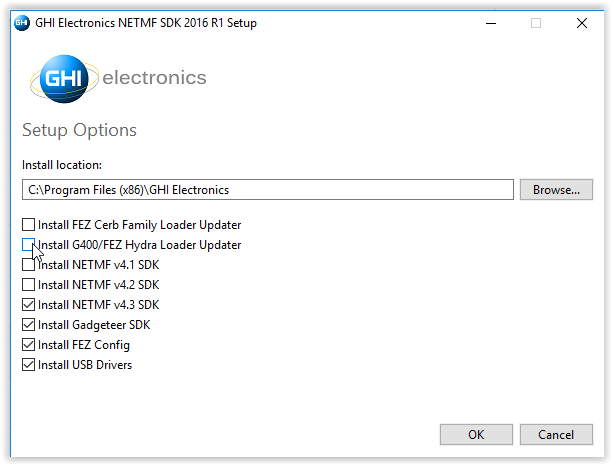
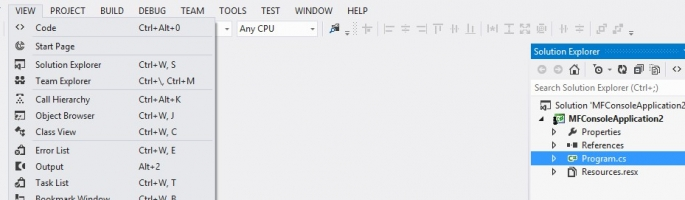
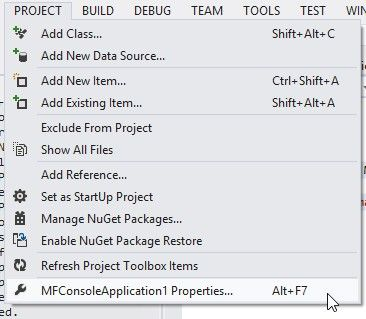
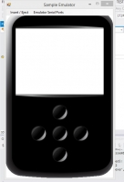
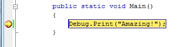
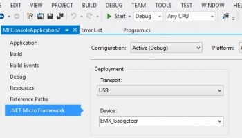

# .NET Micro Framework Getting Started
---

## Installation Steps

### Install Visual Studio Community Edition
Download and install [Microsoft's Visual Studio 2013 Community Edition](http://go.microsoft.com/fwlink/?LinkId=517284).

### Install Microsoft .NET Micro Framework
* Uninstall any currently installed NETMF SDKs.
* Download [Microsoft .NET Micro Framework 4.3 (QFE2)](http://files.ghielectronics.com/downloads/NETMF/SDKs/MS%20NETMF%20QFE2.zip) and unzip the file.
* Open the file's folder and install **MicroFrameworkSDK.MSI** and **netmfvs2013.vsix**.

### Install Microsoft .NET Gadgeteer Core (for Gadgeteer users only)
Download and install [Microsoft .NET Gadgeteer Core](http://gadgeteer.codeplex.com/downloads/get/1519812).
For more information on the future of Gadgeteer, please see this [news post](https://forums.ghielectronics.com/t/the-future-of-gadgeteer/197).

### Install GHI Electronic's NETMF SDK
Download and install GHI Electronics NETMF SDK 2016 R1 from our [NETMF Downloads](downloads.md) page. When installing newer GHI NETMF SDKs, click the `Advanced` button on the opening dialog box and uncheck the boxes to install the FEZ CERB Family and G400/FEZ Hydra loader updaters (the first two options). If needed, these loaders can be installed separately as highlighted in the individual product pages.

Older GHI NETMF SDKs are also available on the [NETMF Downloads](downloads.md) page.

### Get Started with *.NET Micro Framework for Beginners*
To help you get started we have a free e-book in .pdf format: [*.NET Micro Framework for Beginners*](http://files.ghielectronics.com/downloads/Documents/Guides/NETMF%20for%20Beginners.pdf)

## The Emulator

The NETMF SDK includes an emulator for running NETMF applications on the PC. For the first part of this project, the emulator will be used to run a very simple application; afterwards the same program is run on NETMF hardware.

## Create a New Project

Open Visual Studio, select `File > New Project`. There should be a `Micro Framework` option in the left menu. Click on it and then select `Console Application` in the center panel.

> [!Note]
> The pictures used in this tutorial may vary slightly with different versions of the development platform.

Click the `OK` button to create a new project. The project has only one C# file, called `Program.cs`. C# source files are listed in the `Solution Explorer` window. If the Solution Explorer is not open, use the `View > Solution Explorer` menu to open it.

Double click on `Program.cs` to open the file in the editor.
    
    using System;
    using Microsoft.SPOT;
    
    namespace MFConsoleApplication1
    {
        public class Program
        {
            public static void Main()
            {
                Debug.Print(
                    Resources.GetString(Resources.StringResources.String1));
            }
    
        }
    }

For simplicity change the code to match the listing below:
> [!Tip]
> All example code should be copied directly from this page and pasted into the Visual Studio program editor.
    
    using Microsoft.SPOT;
    
    public class Program
    {
        public static void Main()
        {
            Debug.Print("Amazing!");
        }
    }

## Selecting Transport

When compiling a NETMF Console Project, there are options in Video Studio that control where the program is loaded and run.

Select the menu item for the project's properties:

In the Properties window, on the left side tabs, select `.NET Micro Framework` and make sure that `Transport:` is set to `Emulator.`

Console applications have their `Debug.Print` statements appear in Visual Studio's Output Window. The application in this example uses print statements.  If the Output window is not visible, open it by selecting `Output` in the `View` menu.

## Executing

Press `F5` and Visual Studio will compile the program, load it into the emulator and run it.  The emulator displays a hypothetical NETMF device, complete with buttons and a screen. Do not close it.

After a few seconds, the program will stop and the Output window will have "Amazing!" printed (surrounded by other application information).

## Introduction to Debugging

The following sections are a quick introduction to the power and ease of debugging NETMF applications.

Start running the program by pressing `F11` (instead of `F5`), this will "step" into the application instead of just running it.  After deployment, the program starts to run and stops at the very first line of the code. This is indicated by the yellow arrow.

Press `F11` to step to the "Debug.Print" statement. Finally, after pressing `F11` one more time, "Amazing!" is printed in the Output window. Press `F5` to let the program run to completion.

## Breakpoints

Setting breakpoints is simple! -- Click in the bar to the left of the line that prints "Amazing!" A red dot appears to mark the breakpoint location.

Press `F5` to run the software. When the application reaches the breakpoint the debugger will pause:

`F11` can be used to single step execution line by line. `F5` can be used to let the program run.

## Running on Hardware

Deploying and running NETMF applications on hardware is very simple.  Just connect the hardware, change an option in Visual Studio, and all loading, running, debugging, etc. are done on the device. The complete procedure is described below.

> [!Warning] 
> When working with hardware, take care not to expose the hardware to static electricity as it can damage the device.

## Connect and Power-up

Connect the NETMF hardware to the PC using a USB cable. This is done one of two ways.

1. If the processor has an integral USB port and is colored red, plug a USB cable from the computer directly to the board.
2. Processors without an integral USB port will use a Gadgeteer socket to connect the power/USB module to the board. For these boards connect the power module to a "D" labeled socket on the board, then connect the power/USB module to the computer. (These circuit boards are black).

The first time a processor is connected to the computer, Windows will need to load a driver. Wait until the driver is fully loaded before proceeding.

## Updating Device Software

Before using a NETMF device, the embedded software must match the version of the SDK being used. Instructions for updating the embedded software are found on the [Firmware Update](tutorials/firmware-update.md) page.

If necessary, update your firmware, and then return here to continue the tutorial.

Skipping the above step is **the most common problem faced by beginners**.

> [!Tip]
> Many USB hubs are poorly implemented in PCs. If Windows failed to recognize the NETMF device or had any connection problems, make sure the device is connected directly to the PC, not through a USB hub. If problems persist, try using a power transformer or powered USB hub to guarantee the device is getting sufficient power (see also the USB sections in [**NETMF Troubleshooting**](http://old.ghielectronics.com/docs/165/netmf-troubleshooting)).

## Deploying to Hardware

Once the board is connected, Visual Studio has a control to switch back and forth between the emulator and connected hardware.

From the project properties, select USB for transport.. Make sure the setup looks similar to the image below:

Pressing `F5` sends the simple application to the hardware and runs it. Debugging works exactly the same as described above.

## Next Steps

We are currently updating the NETMF documentation found in our NETMF [Tutorials](tutorials/intro.md).

