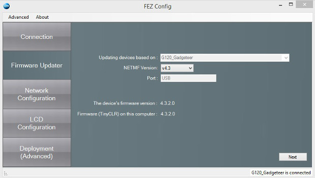
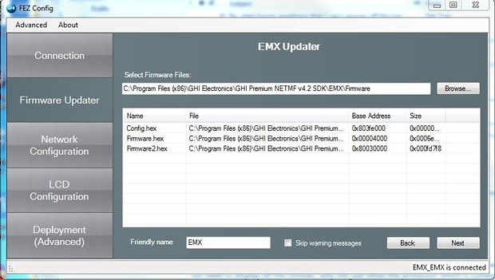

# Firmware Update 
---
> [!Note]
> If you need to update the loader, it should always be done before updating the firmware. See your device's developers' guide or manual for more detail on updating the loader.

Connect your device to your PC.

Launch FEZ Config and click on `Check device for update` button. This will show the
version numbers on the PC and what is loaded on the device.

> [!Note]
> Fez Config is installed when you install the [**NETMF SDK**](../downloads.md#available-netmf-sdks).

To proceed with updating TinyCLR, click on the `Firmware Updater` button on the left and
follow the instructions.

After FEZ Config selects the firmware and the default configuration files, click `Next`.

Click `OK` to proceed when the dialog appears asking if you are having issues.

As the update occurs, the steps and progress are shown. When it is finished, the
module is ready to be flashed with NETMF applications.