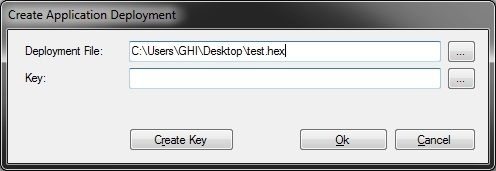

# In-Field Update
---
One of GHI Electronics's additions to NETMF includes the In-Field Update (IFU) class allowing devices to be updated in the field. Updates can be obtained over the network or via USB memory, an SD card, or even through a serial port. File encryption and integrity checking can be implemented if desired.

Once the data is available, it is passed on to IFU and then stored internally in RAM. Once all of the data is received and loaded by the developer, a single call will wipe the flash and write the new files. Only the regions that are being updated are erased.

> [!Warning]
> The final stage will erase the flash and write the new data. This can take some time depending on the board. Losing power during this process will cause the update to fail and require the device to be updated manually.

## Extracting an Existing Application
Creating a hex file to flash to your deployed board is easy. For example, if you have a board in the field (mall kiosk, traffic signal, etc) that is difficult to access, just deploy the new version of your program to another board of the same type. Then open MFDeploy, select USB, and select `Target` > `Application Deployment` > `Create Application Deployment` as shown below.

> [!Tip]
> If you would like the next version of your application to have the same update ability, be sure to include the update code in it as well.


Now select the name of the file that you would like to use and where to save it.



Once this is done, you can place this file on an SD card and insert it into your device, or you can send it to you device over a network. The next section will demonstrate how to load the files and perform the update.

## Getting Started

The following example shows you how to load data into IFU and then flash the device. It requires the GHI.Hardware assembly and assumes that you have already mounted an SD card. Since firmware files can large and often cannot be held in entirely in memory we only load portions of the file at a time.

```
using GHI.Processor;
using System.IO;

public class Program {
    public const int BLOCK_SIZE = 65536;

    public static void FlashFirmware() {
        // Reserve the memory needed to buffer the update.
        // A lot of RAM is needed so it is recommended to do this at the program start.
        InFieldUpdate.Initialize(InFieldUpdate.Types.Firmware | InFieldUpdate.Types.Configuration);

        // Start loading the new firmware on the RAM reserved in last step.
        // Nothing is written to FLASH in this stage. Power loss and failures are okay.
        // Simply abort this stage any way you like!
        // Files can come from storage, from network, from serial bus or any other way.
        LoadFile("\\SD\\Config.hex", InFieldUpdate.Types.Configuration);
        LoadFile("\\SD\\Firmware.hex", InFieldUpdate.Types.Firmware);
        LoadFile("\\SD\\Firmware2.hex", InFieldUpdate.Types.Firmware); //Only if your device has two firmware files.
      
        // This method will copy The new firmware from RAM to FLASH.
        // This function will not return but will reset the system when done.
        // Power loss before this function resets the system will result in corrupted firmware.
        // A manual update will be needed if this method fails (due to power loss for example).
        InFieldUpdate.FlashAndReset();
    }

    public static void LoadFile(string filename, InFieldUpdate.Types type) {
        using (var stream = new FileStream(filename, FileMode.Open)) {
            var data = new byte[BLOCK_SIZE];

            for (int i = 0; i < stream.Length / BLOCK_SIZE; i++) {
                stream.Read(data, 0, BLOCK_SIZE);
                InFieldUpdate.Load(type, data, BLOCK_SIZE);
            }

            stream.Read(data, 0, (int)stream.Length % BLOCK_SIZE);
            InFieldUpdate.Load(type, data, (int)stream.Length % BLOCK_SIZE);
        }
    }
}
```