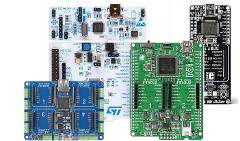

# Supported Boards
---

Our SCM and UCM products all support TinyCLR OS.  TinyCLR can be ported to other devices, and we are providing a ready port for a few popular boards.  For information about some of the third party boards we support, please follow the links below.

* [**STM32 Boards**](stm32_boards.md)
* [**Netduino**](netduino.md)
* [**MikroElektronika**](mikroelektronika.md)

## Firmware Update
The firmware needs to be updated to match the assemblies loaded by Visual Studio. If you see an error message about a checksum error then your project's assemblies version does not match the version loaded on the device.

Each board will have details on how to load its firmware.

***

Visit our main website at [**www.ghielectronics.com**](http://www.ghielectronics.com) and our community forums at [**forums.ghielectronics.com**](https://forums.ghielectronics.com/).