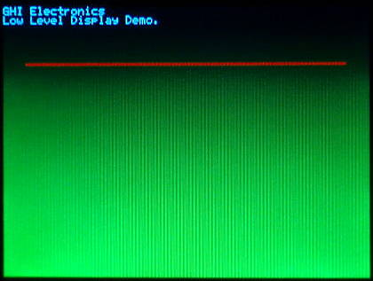

# Display
---
Displays can be grouped into two distinct interface categories, parallel TFT displays and serial (SPI/I2C) displays.

## Parallel TFT Displays
These displays connect to special dedicated pins on the processor. Internally, the display controller automatically transfers (refreshes) the display directly from memory without any processor interaction. When the system needs to update the display, it simply writes to memory. Neither the operating system nor the application program are burdened with display processing. The down side to this is that the system needs to have enough RAM to handle the display. An 800x600 display with 16bpp needs 960,000 bytes! For systems with external memory this should not be an issue.

TinyCLR OS has built in graphics methods for these displays. The following sample code runs on our G400D Dev Board. You will need to add the `GHIElectronics.TinyCLR.Drawing`, `GHIElectronics.TinyCLR.Devices.Gpio` and `GHIElectronics.TinyCLR.Pins` NuGet package to your program and `using System.Drawing`, `using GHIElectronics.TinyCLR.Devices.Display`, `using GHIElectronics.TinyCLR.Devices.Gpio`, and `using GHIElectronics.TinyCLR.Pins` to your code.

In this example, GPIO is only used to turn on the backlight. Note that the backlight on the G400D Dev Board is pulled high with a pullup resistor, so turning on the backlight is unnecessary -- you can only use GPIO pin PD6 to turn it off. However, on the UD435 and UD700 displays a pull down resistor is built into the backlight driver chip. For these display you will need to set the corresponding GPIO pin high to turn on the backlight.

```cs
using System.Drawing;
using GHIElectronics.TinyCLR.Devices.Display;
using GHIElectronics.TinyCLR.Devices.Gpio;
using GHIElectronics.TinyCLR.Pins;

class Program {
    private static void Main() {
        UCMStandard.SetModel(UCMModel.UC5550);
        var backlight = GpioController.GetDefault().OpenPin(UCMStandard.GpioPin.A);
        backlight.SetDriveMode(GpioPinDriveMode.Output);

        var displayController = DisplayController.GetDefault();

        // Enter the proper display configurations
        displayController.SetConfiguration(new ParallelDisplayControllerSettings {
            Width = 480,
            Height = 272,
            DataFormat = DisplayDataFormat.Rgb565,
            HorizontalBackPorch = 46,
            HorizontalFrontPorch = 16,
            HorizontalSyncPolarity = false,
            HorizontalSyncPulseWidth = 1,
            DataEnableIsFixed = false,
            DataEnablePolarity = false,
            PixelClockRate = 12_000_000,
            PixelPolarity = false,
            VerticalBackPorch = 23,
            VerticalFrontPorch = 7,
            VerticalSyncPolarity = false,
            VerticalSyncPulseWidth = 1
        });

        displayController.Enable();
        backlight.Write(GpioPinValue.High);

        // Some needed objects
        var screen = Graphics.FromHdc(displayController.Hdc);
        var greenPen = new Pen(Color.Green, 5);
        var redPen = new Pen(Color.Red, 3);

        // Start Drawing (to memory)
        screen.Clear(Color.Black);
        screen.DrawEllipse(greenPen, 40, 30, 80, 60);
        screen.DrawLine(redPen, 0, 0, 479, 271);

        // Flush the memory to the display. This is a very fast operation.
        screen.Flush();
    }
}
```

## Serial SPI/I2C Displays
Serial displays can work with all microcontrollers. They use common SPI or I2C busses. These displays have built in memory buffers, freeing resources from the system. However, updating graphics is significantly slower than using Parallel TFT Displays. The system will have to send serial commands to identify the memory region to update and then follow that with the new data. This is why serial interfaces are usually used with smaller displays.

To the system, a serial display is nothing but a serial device. You are expected to write your own code to handle graphics.

A good example is the Adafruit Display Shield which uses a SPI display.

This video features a very low cost I2C display option

<iframe width="560" height="315" src="https://www.youtube.com/embed/CL-nSqaGVaw" frameborder="0" allowfullscreen></iframe>

## Low Level Display Access
TinyCLR also provides low level display access as part of the `GHIElectronics.TinyCLR.Devices.Display` library. These methods provide a simple way to write to a display without need for the `System.Drawing` library or an added font resource file.

The following example is written for the G120E Dev Board and will paint the screen as shown in the picture beneath the code. Note that low level display access requires that you to use the data format required by your display as configured. The G120E Dev Board used in this example expects each pixel to have 16 bits (two bytes per pixel) of color information in RGB565 format.

```csharp
using GHIElectronics.TinyCLR.Devices.Display;

class Program {
    private static void Main() {
        var displayController = DisplayController.GetDefault();

        // Enter the proper display configurations
        displayController.SetConfiguration(new ParallelDisplayControllerSettings {
            Width = 320,
            Height = 240,
            DataFormat = DisplayDataFormat.Rgb565,
            HorizontalBackPorch = 29,
            HorizontalFrontPorch = 51,
            HorizontalSyncPolarity = false,
            HorizontalSyncPulseWidth = 41,
            DataEnableIsFixed = true,
            DataEnablePolarity = true,
            PixelClockRate = 15000000,
            PixelPolarity = true,
            VerticalBackPorch = 3,
            VerticalFrontPorch = 16,
            VerticalSyncPolarity = false,
            VerticalSyncPulseWidth = 10
        });

        displayController.Enable();

        byte[] myPic = new byte[320 * 240 * 2];
        for (var i = 0; i < myPic.Length; i++) {
            myPic[i] = (byte)(((i % 2) == 0) ? ((i / 2400) & 0b00000111) << 5 : i / 19200);
        }

        displayController.DrawString("\f");
        displayController.DrawBuffer(0, 0, 320, 240, myPic, 0);
        displayController.DrawString("GHI Electronics\n");
        displayController.DrawString("Low Level Display Demo.");

        for (var x = 20; x < 300; x++) {
            displayController.DrawPixel(x, 50, 0xF800);     //Color is 31,0,0 (RGB565).
            displayController.DrawPixel(x, 51, 0xF800);
        }
    }
}

```

G120E Dev Board display after running the sample code:

