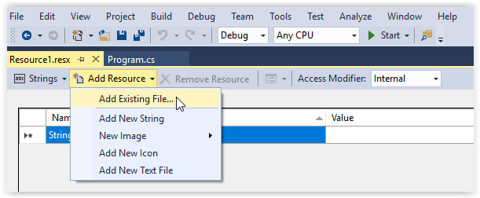

# Graphics

You can use the `GHIElectronics.TinyCLR.UI` library to create user interfaces for your application. It is inspired by WPF on the desktop. The sample below shows how to use a few of the available elements. Make sure to provide your display configuration and the font you want to use. You can also feed in touch and button events from any source you want to use.

```csharp
using GHIElectronics.TinyCLR.Devices.Display;
using GHIElectronics.TinyCLR.UI;
using GHIElectronics.TinyCLR.UI.Controls;
using GHIElectronics.TinyCLR.UI.Media;

namespace UI {
    public class Program : Application {
        public Program(DisplayController d) : base(d) {
        }

        public static void Main() {
            var disp = DisplayController.GetDefault();

            disp.SetConfiguration(new ParallelDisplayControllerSettings {
                //Your display configuration
            });

            disp.Enable();

            var app = new Program(disp);

            //Use the below two functions to pass input to the UI system
            //app.InputProvider.RaiseTouch(x, y, touchState, DateTime.UtcNow);
            //app.InputProvider.RaiseButton(btn, btnState, DateTime.UtcNow);

            app.Run(Program.CreateWindow(disp));
        }

        private static Window CreateWindow(DisplayController disp) {
            //Setup
            var window = new Window {
                Height = (int)disp.ActiveConfiguration.Height,
                Width = (int)disp.ActiveConfiguration.Width
            };

            window.Background = new LinearGradientBrush(Colors.Red, Colors.Blue, 0, 0,
                window.Width, window.Height);

            //In next line replace "YourFont" with name of font you added to Resources file.
            var font = Resource1.GetFont(Resource1.FontResources.YourFont);

            OnScreenKeyboard.Font = font;


            //List
            var listBox = new ListBox();

            listBox.Child.Width = window.Width;


            //Text
            for (var i = 0; i < 3; i++) {
                var text = new Text(font, $"Text item {i}");

                text.SetMargin(5);

                listBox.Items.Add(text);
            }


            //Button
            var j = 0;
            var val = new Text(font, "Tap Me");
            var btn = new Button {
                Child = val,
                Width = 100
            };

            btn.SetMargin(5);
            btn.Click += (s, e) => val.TextContent = "Tap Me " + (j++).ToString();

            listBox.Items.Add(btn);


            //Textbox
            var txt = new TextBox {
                Font = font,
                Text = "Text Sample"
            };

            txt.SetMargin(5);
            listBox.Items.Add(txt);


            //Setup
            window.Child = listBox;
            window.Visibility = Visibility.Visible;

            return window;
        }
    }
}
```

## Fonts

Fonts can be included in your TinyCLR application by adding them as a resource. Any TrueType font can be used after being converted to the .tcfnt format with the FontConverter tool.

### Converting TrueType Fonts

> [!Note]
> Many fonts are copyrighted. It is up to you to make sure you can legally use a specific TrueType font in your application.

TrueType fonts must be converted to a .tcfnt file before you can add them to your TinyCLR application. [Font Converter](../downloads.md#tinyclr-font-converter) is a command line utility which does just that. It can be found on the [Downloads page](../downloads.md#tinyclr-font-converter). 

To convert a font you must first make a .fntdef file which is a text file describing the font to convert as well as a number of other parameters. This file contains one option on each line. A minimal .fntdef file may look like this to have the standard ASCII characters.

```
SelectFont "FN:Arial,WE:400,HE:12,IT:0"
ImportRange 32 126
```

> [!TIP]
> This third-party [tool](http://informatix.miloush.net/microframework/Utilities/TinyFontTool.aspx) can be handy for generating fonts.

The .fntdef file options are as follows:

> [!Note]
> The order of statements in the .fntdef file matters. For example, properties such as AntiAlias must be specified before the InputRange property.

* AddFontToProcess *path*
  
    *Path* is the path to the TrueType font you want to convert. If the path contains spaces, you must enclose it in quotes and escape any backslashes.

    Example: `AddFontToProcess C:\Windows\Fonts\Arial.ttf`

* SelectFont *"selection string"*

    *"Selection string"* is a quoted string containing comma delimited fields indicating the characteristics of the font to convert. ConvertFont searches the TrueType fonts installed on your computer, as well as any fonts in the AddFontToProcess argument, for a font matching the characteristics in the *selection string* argument. The first match is converted.

    Using spaces around the commas or colons in *selection string* will result in errors. Field types are as follows:

    * HE: Height in logical units. Use zero for default height, a positive number for cell height and a negative number for character height.
    * WI: Width. Average width of characters in logical units. Set to zero for closest match based on aspect ratio.
    * ES: Escapement angle in tenths of a degree. Negative numbers rotate clockwise, positive numbers rotate counterclockwise.
    * WE: Weight of font in range of 0 to 1000. 400 is normal, 700 is bold. Set to zero for default weight.
    * IT: Italic if set to 1 (IT:1).
    * FN: Face name. Name of the typeface.
    * FullName: Full name. The unique name of the font. For example: "Monotype:Arial Regular (Microsoft)."

  For example, `SelectFont "HE:12,WE:400,FN:Arial"` will look for a regular-weight font of height 12 with a face name of "Arial."

* AdjustAscent *adjustment*

    *Adjustment* is integer number of EM units to adjust ascent. Can be positive or negative. Can only be used once per .fntdef file. If it is used more than once, only the last occurrence will be used.

* AdjustDescent *adjustment*

    *Adjustment* is integer number of EM units to adjust descent. Can be positive or negative. Can only be used once per .fntdef file. If it is used more than once, only the last occurrence will be used.

* AdjustExternalLeading *adjustment*

    *Adjustment* is integer number of EM units to adjust the external leading. Can be positive or negative. Can only be used once per .fntdef file. If it is used more than once, only the last occurrence will be used.

* AdjustInternalLeading *adjustment*

    *Adjustment* is integer number of EM units to adjust the internal leading. Can be positive or negative. Can only be used once per .fntdef file. If it is used more than once, only the last occurrence will be used.

* AdjustLeftMargin *adjustment*

    *Adjustment* is integer number of device units to add to the left margin. Can be positive or negative. Applies to the characters specified by the ImportRange statement that most closely follows this option.

* AdjustRightMargin *adjustment*

    *Adjustment* is integer number of EM units to add to the right margin. Can be positive or negative. Applies to the characters specified by the ImportRange statement that most closely follows this statement.

* AntiAlias *level*

    *Level* can be 1, 2, 4, or 8. Font bitmaps will contain 2, 5, 17, or 65 levels of gray respectively. Must come after the SelectFont statement specifying the font to which this statement applies. May be applied to a range of characters defined by the ImportRange option.

* ImportRange *start end*

    *Start* and *end* are Unicode character codes indicating the beginning and end of the range of characters to convert (inclusive). Can be applied multiple times to convert a non-contiguous range of characters. Must come after the SelectFont statement specifying the font to which this statement applies. Both arguments are required. To specify a single character, make start and end the same number.

* ImportRangeAndMap *start end offset*

    Specifies range of characters to convert starting with Unicode character *start* + *offset* and ending with character *end* + *offset*, inclusive. Can be applied multiple times to convert a non-contiguous range of characters. Must come after the SelectFont statement specifying the font to which this statement applies.

* NoDefaultCharacter

    Specifies that no default character will be substituted for characters not converted. Must come after the SelectFont statement specifying the font to which this statement applies.

* OffsetX *adjustment*

    *Adjustment* is an integer describing the number of EM units to shift character position left or right. Positive numbers shift to the left, and negative numbers shift to the right. Applies to characters specified by any ImportRange, ImportRangeAndMap, or SetAsDefaultCharacter statements that follow it in the .fntdef file. Subsequent OffsetX statements supersede all previous OffxetX statements in the same .fntdef file.

* OffsetY *adjustment*

    *Adjustment* is an integer describing the number of EM units to shift character position up or down. Positive numbers shift down, and negative numbers shift up. Applies to characters specified by any ImportRange, ImportRangeAndMap, or SetAsDefaultCharacter statements that follow it in the .fntdef file. Subsequent OffsetX statements supersede all previous OffxetX statements in the same .fntdef file.

* SetAsDefaultcharacter *charcode*

    *"Charcode* is the Unicode character code for the default character to substitute for characters that weren't converted.

* SetDefaultcharacter

    Indicates that the default character of the currently selected TrueType font will be substituted for characters that weren't converted.

* Verbosity *level*

    > [!Note]
    > Not currently supported, set to 0.

    *Level* can be 0, 1, or 2. Level 0 displays no details, level 1 displays font properties, and level 2 displays font and character properties and a diagram of each character.

* \# Comments

    You can add comments to your .fntdef file by starting the comment line with the "#" character.

Syntax for running FontConverter is GHIElectronics.TinyCLR.FontConverter.exe *input-font* *output-font*. For example `GHIElectronics.TinyCLR.FontConverter.exe Arial.fntdef Arial.tcfnt`.

### Adding Fonts to Your Application

Once a TrueType font has been converted to a .tcfnt file, it can be added as a resource to your TinyCLR application. To add a font resource to your project, select `Add New Item...` in the Visual Studio `Project` menu. In the `Add New Item` dialog box select `Resources File` and click the `Add` button.


Then, on the tab for your resource file, click on the small down arrow on the right of the `Add Resource` button and select `Add Existing File...`. 




Use the `Add existing file to resources` dialog box to find and open the .tcfnt file you created using FontConverter.
