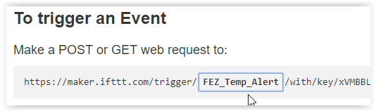

# *If This Then That* IOT Example.
---
If This Then That (IFTTT) is a free service allowing users to automate tasks by using simple conditional statements to create scripts or Applets (previously called "recipes"). There are several similar platforms you might also want to check out including [ThingSpeak](https://thingspeak.com/), [Stringify](https://www.stringify.com/), [Yonomi](https://www.yonomi.co/), and [Home Assistant](https://www.home-assistant.io/). IFTTT can be used to respond to both online events and events from devices. Some uses include:

* Turn on the lights when you come home.
* Send a text message if rain is forecast.
* Turn on your lights if your Ring doorbell senses motion.
* Turn off your Wi-Fi when you aren't home.
* Send you an e-mail when the *New York Times* publishes a new article in its science section.
* Automatically back up your smart phone photos to the cloud.
* Automate GitHub tasks.
* Get a text message whenever a Craigslist post matches your search.
* Notify you when the International Space Station passes overhead.
* Track when your company is mentioned on Twitter or Reddit.

The possibilities are almost endless. Here we will take you step by step through the process of making a simple FEZ based temperature alarm the will send a text message when the temperature drops below ten degrees celsius. First we will set up an IFTTT account, then create and test the needed applets, and finally program the FEZ to trigger the IFTTT applet.

## Create an IFTTT Account

Signing up for IFTTT is easy and free -- just go to [IFTTT.com](https://ifttt.com) and click on the `Sign up` button in the upper right hand corner of the screen. You can sign up using your Google or Facebook account, or use an e-mail address and password to sign in. You'll want to get past where IFTTT is asking you to pick sites you use regularly or is introducing applets and get to the main screen. You can either select some sites/applets your just hit the "X" in the upper right corner.

## Create the IFTTT Applets

Three IFTTT applets will be needed for this project. An SMS Applet will be used to send the text message to your phone. A Webhooks Applet will be used to receive an HTTP GET request from the FEZ when the temperature goes below ten degrees. Finally, an If This Then That Applet will call the SMS Applet when triggered by the Webhooks Applet.

### Create an SMS Applet

This is the Applet that will send a text message to your phone.

In the search bar, search for "sms" and click on `Services` in the results page, then click on the `SMS` box (or click on this [link](https://ifttt.com/services/sms)).

Now click on the `Connect` button. You will be taken to a screen asking for your phone number. This is the number the text message will be sent to. Enter your phone number and click on the `Send PIN` button. IFTTT will send a PIN to your phone that is used to verify that the phone number is correct. After entering the four digit PIN and hitting the `Connect` button, you will be sent back to the SMS screen. The `Connect SMS` applet is now configured and tied to your phone number.

### Create a Webhooks Applet

This is the Applet that will receive an HTTP GET command from the FEZ when the temperature goes below ten degrees.

Search for "webhooks," click on `Services`, and then click on the `Webhooks` box (or use this [link](https://ifttt.com/services/maker_webhooks)). IFTTT Webhooks provides a way to trigger an Applet when an HTTP GET or PUT instruction is sent to a given web address. On the `Webhooks` page, click on the `Connect` button. `Documentation` and `Settings` buttons should appear at the upper right of your screen. 

Click on the `Documentation` button. A page with your key and instructions for triggering an event will appear. The URL under `Make a POST or GET web request to:` is where the FEZ will send the GET request. You will need to cut and paste your key into the C# program that will be running on the FEZ.

There is a `Test It` button on the screen, but the Webhooks Applet is not yet connected to the SMS Applet, so clicking on this button will not send a text to your phone.

### Create an If This Then That Applet

We now have to create an applet that will use the Webhooks Applet as a trigger (if this) to call the SMS Applet (then that). In other words, if the Webhooks Applet receives the correct HTTP GET request, then the SMS Applet will send a text.

Click on `Back to service`. Click on `My Applets` at the top left of the screen and then click on `New Applet` on the right side of the screen. Now click on `+this` which is highlighted in blue. You will be asked to choose a service. Search for "webhooks" and then click on the `Webhooks` box.

Now you will be asked to choose a trigger. Click on the `Receive a web request` box.

You will be asked to complete the trigger fields. Type in the event name "FEZ_Temp_Alert" and hit the `Create trigger` button.

Now click on `+that`. You will be asked to choose an action service. Click on the green `SMS` box (search for "sms" if you don't see it), and then click on the green `Send me an SMS` box. You will be asked to complete action fields. We want to include the temperature reading as part of the text message, so click on the `Add Ingredient` button and select `Value1`. Now click the `Create action` button. You will now be asked to review and finish. If everything looks good hit the `Finish` button.

### Testing Your IFTTT Applets

Let's test the Applets. Click on `My Applets` at the top left of the screen. Click on `Services` and then `Webhooks`. Click on the `Documentation` button. In the `{event}` field in the POST/GET URL, type in "FEZ_Temp_Alert" as shown below. If you cut and past the URL into your web browser and hit the `Enter` key you should recieve a text message on your phone.



## Setup the FEZ

To setup the FEZ we will have to connect a temperature sensor and then program the FEZ to send the proper HTTP GET request when the temperature drops below 10 degrees.

### Connect the Temperature Sensor

For this demo we programmed the FEZ to act as a temperature alarm, but the same principles can be applied to any sensor that can be connected to the FEZ. You can also test the program without any sensor at all - just call SendSmsAlert() to simulate an alarm condition.

For our temperature sensor we used an NPN transistor (2N2222A) and an 8.2K resistor as they were sitting conveniently on my desk. They were wired as shown below. Power for the temperature sensor is controlled by GPIO pin A1. 3V3 could have been used, but by using a GPIO pin the sensor can be turned off between readings to reduce the effects of self heating.


The transistor is wired with its base and collector connected together so it is acting as a diode. When a constant current passes through this diode the voltage drop is a linear function with a temperature coefficient of about two millivolts per degree celsius. While a series resistor does not provide a true constant current source, it will be plenty accurate for this demo.

### Programming the FEZ

Start a new C# project. You will need to add the following NuGet packages:

* GHIElectronics.TinyCLR.Core
* GHIElectronics.TinyCLR.Devices.Adc
* GHIElectronics.TinyCLR.Devices.Gpio
* GHIElectronics.TinyCLR.Devices.Spi
* GHIElectronics.TinyCLR.Native
* GHIElectronics.TinyCLR.Networking
* GHIElectronics.TinyCLR.Networking.Http
* GHIElectronics.TinyCLR.Pins

Cut and paste the following code into the `Program.cs` window. You will have to change the Wi-Fi SSID and password (line 50) and cut and paste your IFTTT key into line 53 near the end of the program (replace `Paste_IFTTT_Key_Here`). To copy your key, click on `My Applets` on the IFTTT website, then click on `Services`, click on the `Webhooks` box, and click on the `Documentation` button.

```csharp
using GHIElectronics.TinyCLR.Devices.Adc;
using GHIElectronics.TinyCLR.Devices.Gpio;
using GHIElectronics.TinyCLR.Devices.Spi;
using GHIElectronics.TinyCLR.Drivers.STMicroelectronics.SPWF04Sx;
using GHIElectronics.TinyCLR.Pins;
using System;
using System.Threading;

class Program {
    private static void Main() {
        var gpioCont = GpioController.GetDefault();
        var reset = gpioCont.OpenPin(FEZ.GpioPin.WiFiReset);
        var irq = gpioCont.OpenPin(FEZ.GpioPin.WiFiInterrupt);
        var wifiGpio8 = gpioCont.OpenPin(FEZCLR.GpioPin.PA0);
        var tempSensePower = gpioCont.OpenPin(FEZ.GpioPin.A1);

        var spiCont = SpiController.FromName(FEZ.SpiBus.WiFi);
        var spi = spiCont.GetDevice(SPWF04SxInterface.GetConnectionSettings(SpiChipSelectType.Gpio, FEZ.GpioPin.WiFiChipSelect));

        var adcController = AdcController.GetDefault();
        var tempSense = adcController.OpenChannel(FEZ.AdcChannel.A0);

        tempSensePower.SetDriveMode(GpioPinDriveMode.Output);
        tempSensePower.Write(GpioPinValue.Low);

        wifiGpio8.SetDriveMode(GpioPinDriveMode.InputPullDown);

        while (true) {
            tempSensePower.Write(GpioPinValue.High);
            var tempSenseValue = tempSense.ReadRatio();
            tempSensePower.Write(GpioPinValue.Low);

            // ADC value was 0.589 volts at 21 degrees celsius.
            var temperature = 21 - (tempSenseValue * 3.3 - 0.589) / 0.002;
            temperature = Math.Round(temperature * 10) / 10;

            if (temperature < 10) {
                SendSmsAlert(temperature);
                Thread.Sleep(2 * 60 * 60 * 1000);   // Don't alert more than once every 2 hrs.
            }
            Thread.Sleep(1000);
        }

        void SendSmsAlert(double temperature) {
            var wifi = new SPWF04SxInterface(spi, irq, reset);

            wifi.TurnOn();
            Thread.Sleep(10000);

            wifi.JoinNetwork("GHI", "password");
            Thread.Sleep(10000);

            var triggerString = "/trigger/FEZ_Temp_Alert/with/key/Paste_IFTTT_Key_Here?value1=" + temperature.ToString();
            wifi.SendHttpGet("maker.ifttt.com", triggerString, 80, SPWF04SxConnectionSecurityType.None);

            wifi.TurnOff();
            wifi.Dispose();
        }
    }
}

```


