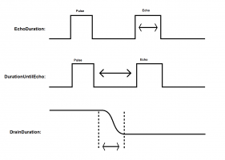

# Pulse Feedback
---
The PulseFeedback class can be used in three different modes. The below image shows an example pin capture for each of the modes. It is not drawn to scale. The area marked by the arrows is the time measured for each mode. Remember that the pulse and echo may be on separate pins.



The first mode is EchoDuration. This mode sends a pulse of a given length and state over the provided pin. It then waits for an echo on the other specified pin and measures how long that echo pulse was. The echo and pulse pin can be the same if desired. 

The next mode is DurationUntilEcho. It is very similar to EchoDuration, although instead of sending a pulse and measuring the length of the resulting echo, it measures how long it takes until that echo is received.

The final mode is DrainDuration. This mode is often used in capacitive touch. When calling Read, the pulse line will be held in the specified state for the specified time and then set to an input. When a resistor and capacitor are connected to this pin and ground, the pin will fall to ground after a short period of time dependent on the capacitance on the pin. The below image shows a sample circuit. Do note that this mode can only be used with a single pin.


The below example illustrates sending a pulse of 10us and reading an echo on a second pin where both the pulse and echo are high, without using any pull-up or pull-down resistors. It prints out the total duration of the echo. It repeats every 250ms.

```csharp
using GHIElectronics.TinyCLR.Devices.Gpio;
using GHIElectronics.TinyCLR.Devices.Signals;
using GHIElectronics.TinyCLR.Pins;
using System;
using System.Diagnostics;
using System.Threading;

public static class Program {
    public static void Main() {
        var pulse = new PulseFeedback(FEZ.GpioPin.D0, FEZ.GpioPin.D1, PulseFeedbackMode.EchoDuration) {
            DisableInterrupts = false,
            Timeout = TimeSpan.FromSeconds(1),
            PulseLength = TimeSpan.FromTicks(100),
            PulsePinValue = GpioPinValue.High,
            EchoPinValue = GpioPinValue.High,
            PulsePinDriveMode = GpioPinDriveMode.Input,
            EchoPinDriveMode = GpioPinDriveMode.Input
        };

        while (true) {
            Debug.WriteLine(pulse.GeneratePulse().TotalMilliseconds.ToString("N0"));

            Thread.Sleep(250);
        }
    }
}

```