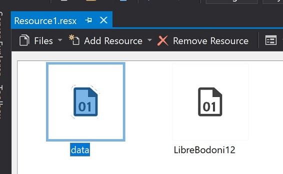

# Resources
---

From fonts and bitmaps to lookup tables and binary files, TinyCLR OS lets you add resources right into the program to access later. 

Right-click on your project and `Add->New Item...`. From here select `Resource File`.

You can now drag resources right into the file.

In the background, a file is generated to reflect the added resources. Using the resource will look similar to `var resourceData = Resource.GetBytes(Resource.BinaryResources.data);`

> [!Tip]
> If you are copying an example code that uses resource, some minor changes are needed to match the resources' names in your project.

