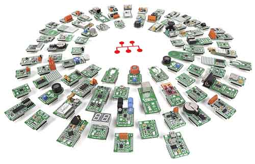

# MikroElektronika Arduino UNO Click Shield

 

Through Mikro Electronica's [mikroBUS standard](https://www.mikroe.com/mikrobus/), hundreds of [Mikro's Click boards](https://shop.mikroe.com/click) can be easily connected to your board.

The [BrainPad](../../brainpad/intro.md), [Clicker](../boards/clicker.md), and [Quail](../boards/quail.md) boards all have sockets for plugging click boards.

This video talks about the technology behind SPI bus, shift registers, and serial-parallel data. It uses the [LED ring click](https://shop.mikroe.com/led-ring-r-click) on the BrainPad.

<iframe width="560" height="315" src="https://www.youtube.com/embed/2qYLsM9DoBI" frameborder="0" allowfullscreen></iframe>

The source code is found [here](https://github.com/ghi-electronics/Tech-Talks/tree/master/044%20-%20SPI%20Bus).

You can use these click boards with [FEZ](../../hardware/products/fez.md), or any other Arduino-pinout compatible board, through the [Arduino UNO click shield](https://shop.mikroe.com/arduino-uno-click-shield).

The same code used above with the BrainPad can be used with FEZ and the Arduino UNO click shield. Simply, change the pins from BrainPad to FEZ. The pins are labeled right on the shield. For example, the `CS` pin on socket 1 is labeled `CS/D10`.

The complete project is found [here](https://github.com/ghi-electronics/TinyCLR-Accessories)
