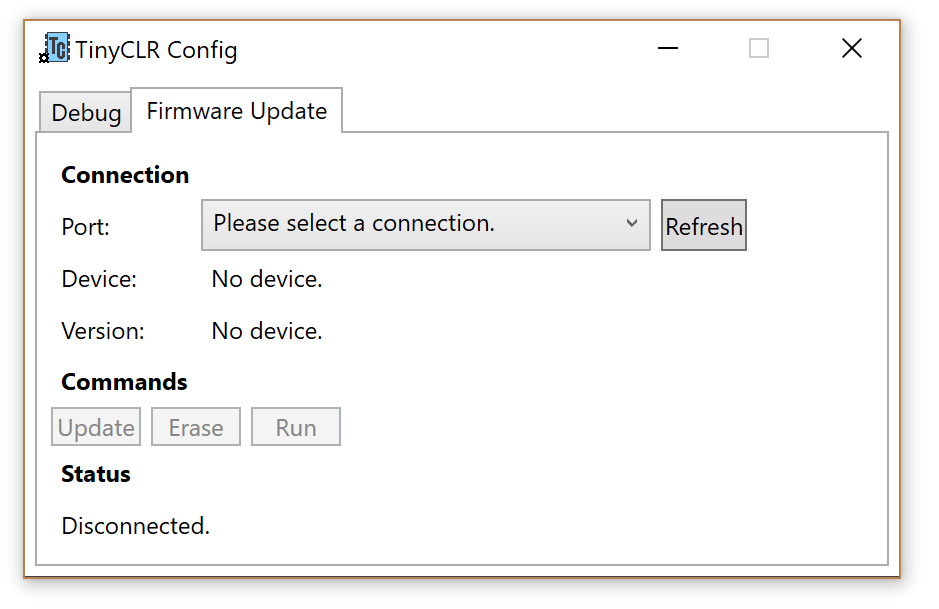

# TinyCLR Config
TinyCLR Config is a stand-alone tool to help managing TinyCLR OS devices. The tool is cloud-connected. It automatically finds and downloads newer firmware versions from a list of provided sources. These sources can be on the internet or local on your machine if you don't have or don't want to access to the internet. The firmware update functionality only works for devices that have [GHI Bootloader v2](../hardware/loaders/ghi_bootloader.md).

The TinyCLR Config tool is stil in development. Please [stay tuned](https://forums.ghielectronics.com/c/announcements).

# Firmware Sources
When TinyCLR Config starts up, it looks for a file called `FirmwareSources.txt` in the same directory as the TinyCLR Config executable itself. If the file isn't present, it's created automatically with one entry pointing to the official GHI firmware store.

The file is a comma-separated list of sources, one per line. The first value is an integer priority with lower numbers being searched first. Each source is tried until a newer version than the currently flashed version is found. The next value is either `Local` or `Network` which determines where the next value points to: the local disk or the network. The last value is a URI that points to an xml file that defines the list of available firmwares.

The firmware xml list is made up of a list of devices. Each device has a name attribute and firmware list child. Within the firmware list is a list of each available firmware. Each firmware must have an MD5 hash that matches the file pointed to, a version of the form `major.minor.patch`, a release date, and a uri that points to the location of the firmware (the location type must match the location type of the firmware list itself, i.e. local vs network). See the official hosted file for a complete example.