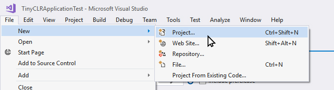
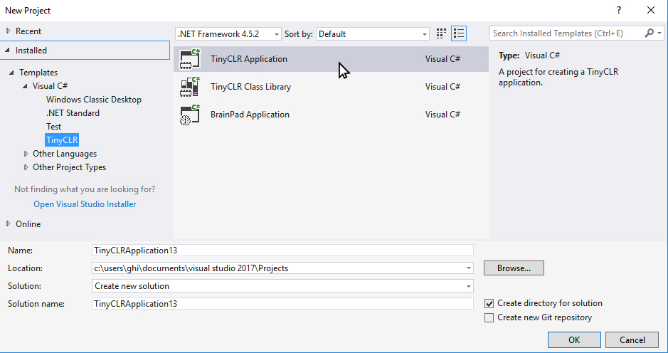
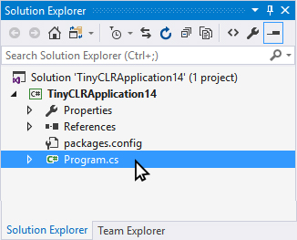
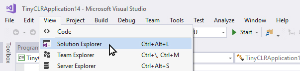
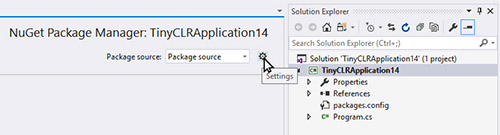
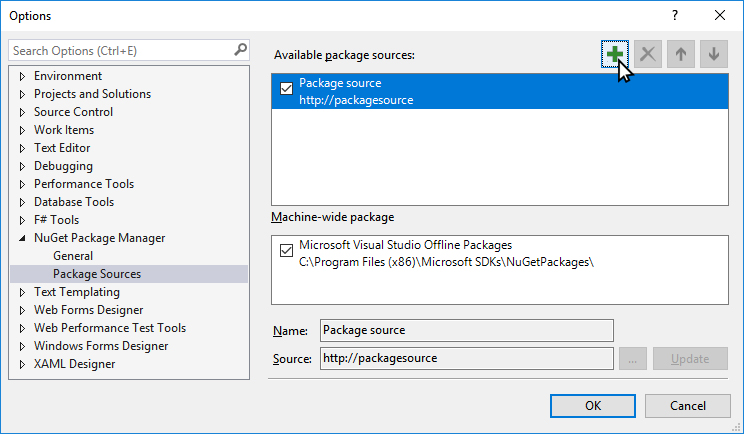

# TinyCLR Tutorials

Here you will find tutorials covering different features of the TinyCLR OS. We try to keep the documents hardware-generic as much as possible but when we can't, we use [FEZ](../../hardware/fez.md) as a reference.
___

## Getting Started
First you'll need to download and install Visual Studio 2017 Community Edition, if you already haven't 

* [Visual Studio 2017 Download](https://www.visualstudio.com/downloads/)

Next you have to download the lastest version of TinyCLR OS here:

 
* [TinyCLR OS Download](http://ghielectronics.com/downloads/TinyCLR/TinyCLR.0.4.0.zip)

Release notes:
* [TinyCLR OS Release Notes](https://www.ghielectronics.com/docs/350/tinyclr-os)

The TinyCLR OS zip file you downloaded contains all files you'll currently need to run TinyCLR OS. 

Extract all the files from the downloaded zip into a folder on your desktop. 

Next run the VSIX installer file, found inside the folder you just extracted to your DESKTOP

* [TinyCLR OS Visual Studio extension](https://www.ghielectronics.com/downloads/TinyCLR/v0.5.0/TinyCLR.0.5.0.vsix)

Connect your device to your PC using a USB cable.

___

## Create a New Project

Open Visual Studio, select FILE>New Project. 

   

There should be a "TinyCLR" option under "Visual C#"
Click the "OK" button a project and program are created. 

   

The project has only one C# file, called Program.cs. C# source files are listed in the "Solution Explorer" window. 

 

If the Solution Explorer is not opened, use the VIEW->Solution Explorer menu.

 

## Adding NuGet Packages
TinyCLR OS uses NuGet packages, all libraries will be downloaded through NuGet. Because of this, there will be no SDK to install or machines to lock to specific versions. Simply use NuGet to download any needed version of any needed library on a per-project basis.

To manage your NuGet packages, right click on your Project in the Solution Explorer and select "Manage NuGet Packages"
 

## Local Hosting NuGet packages

Since TinyCLR OS is still so new, we haven't yet uploaded any packages to NuGet, so make sure to download the available libraries, extract the archive, and place them in a local NuGet feed.

To do this you'll have to point Visual Studio to that local NuGet feed. 

After selecting "Manage NuGet Packages" select the "Package Source" Setting icon. 

 

Next you'll click the "+" to add an new Package source. 

Then select the location where the NuGet packages are stored locally, by pressing the ... icon. 

 