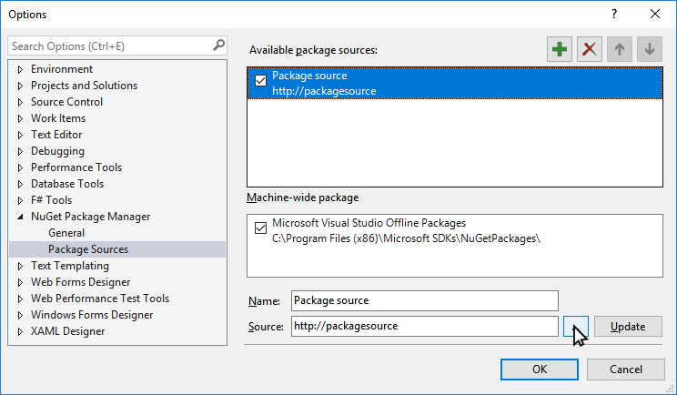
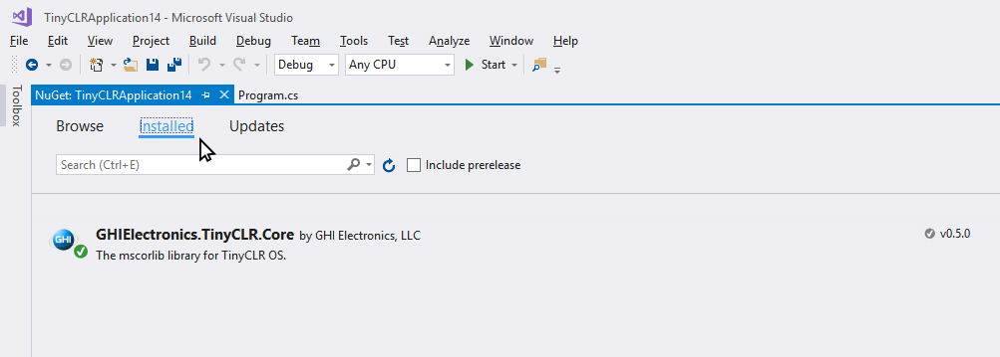
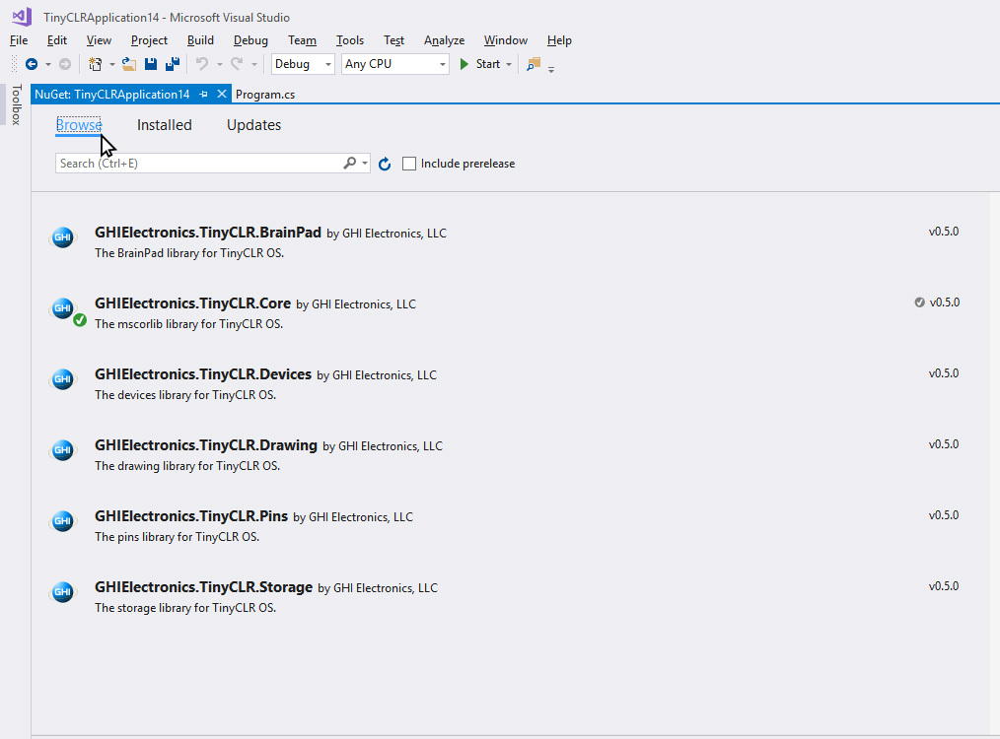
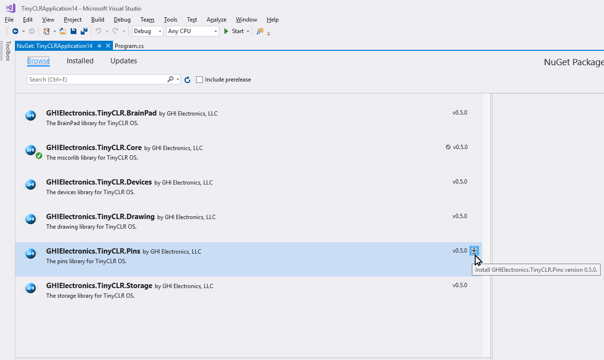
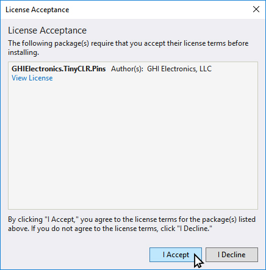

# TinyCLR Tutorials
---

Here you will find tutorials covering different features of the TinyCLR OS. We try to keep the documents hardware-generic as much as possible but when we can't, we use [FEZ](../../fez/intro.md) as a reference.

## System Setup
Follow [these steps](../intro.md) to setup your development machine.

## Starting a New Project

Open Visual Studio, select ` File > New Project`. 

   

There should be a `TinyCLR` option under `Visual C#`

Click the "OK" button a project and program are created. 

   

The project has only one `C#` file, called `Program.cs`. `C#` source files are listed in the `Solution Explorer` window. 

 

If the `Solution Explorer` is not opened, use the `View > Solution Explorer` menu.

 

## Adding NuGet Packages
TinyCLR OS uses NuGet packages, all libraries will be downloaded through NuGet. Because of this, there will be no SDK to install or machines to lock to specific versions. Simply use NuGet to download any needed version of any needed library on a per-project basis.

To manage your NuGet packages, right click on your Project in the Solution Explorer and select `Manage NuGet Packages`

 

## Local Hosting NuGet packages

Since TinyCLR OS is still so new, we haven't yet uploaded any packages to NuGet, so make sure to download the available libraries, extract the archive, and place them in a local NuGet feed.

To do this you'll have to point Visual Studio to that local NuGet feed. 

After selecting `Manage NuGet Packages` select the "Package Source" Setting icon. 

 

Next you'll click the "+" to add an new Package source. 

Then select the location where the NuGet packages are stored locally, by pressing the ... icon. 

 

After Selecting the local folder where the downloaded NuGet packages are. You can select the "Installed" Tab to view the NuGet Packages installed. 

 

Selecting the "Browse" Tab will show all the NuGet packages located in your local NuGet feed. Those installed are noted with a GREEN check mark in front of the name. 

 

To install one of the packages. 

 

The last thing to do is accept the licensing agreement. 

And, that's it! You're now ready to start programming using TinyCLR OS. Fit the F5 key to build and deploy your application.

(add more images for build and deploy and see a message on the output window)

