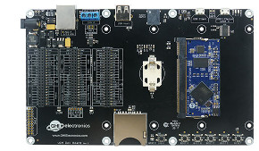

# UCM Accessories
---

Our UCM accessories are provided to speed the development of your product.  These accessories make it possible to start programming your application within minutes without designing or building new hardware.

If your design does require custom hardware, you can use these accessories as the foundation of your prototype and then add your custom circuits to them.  Combined with TinyCLR, this allows you to quickly demonstrate a working prototype and get customer approval without a large investment in hardware and software design.

## UCM Dev Board

Our UCM Dev Board is the fastest and easiest way to start using our UCMs.  This board provides a socket for the UCM, standard connectors for input/output, and three 40 pin socket headers for connecting to peripherals and a display.  Our display modules have mating 40 pin headers.  This allows you to mount the display directly to the Dev Board or mount the display remotely using standard IDE hard drive cables.
  
## UCM Breakout Board

Our UCM Breakout Board provides a socket for our standard UCMs, and both through hole and surface mount edge connections for soldering the Breakout Board to your own circuit board.  This board makes it easier to use our UCMs in prototypes or products without the need to solder the fine pitch 200 pin SO-DIMM socket to your board.  You can also solder pin headers to the Breakout Board and use traditional breadboarding techniques to build your prototype.

## UD435

A 4.3 inch or 5 inch capacitive touch LCD screen for the UCM Dev Board or UCM Breakout.  Has a 40 pin male header connector that can be plugged directly into the UCM Breakout Board or connected using a standard 40 pin IDE hard drive cable.

## UD700

A 7 inch capacitive touch LCD screen for the UCM Dev Board or UCM Breakout.  Has a 40 pin male header connector that can be plugged directly into the UCM Breakout Board or connected using a standard 40 pin IDE hard drive cable.

***

Need a solution for harsh or high vibration environments?  Check out our [**SCMs**](../scm/intro.md).

Visit our main website at [**www.ghielectronics.com**](http://www.ghielectronics.com) and our community forums at [**forums.ghielectronics.com**](https://forums.ghielectronics.com/).