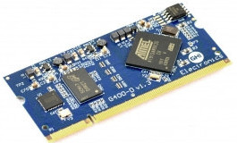
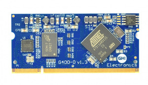

# Universal Compute Modules
---

Our Universal Compute Modules are based on a 200 pin SO-DIMM form factor.  All models follow a standard pin out making it easy to change modules to fit the needs of your product.

Our UCMs and SCMs can be programmed using a variety of languages and development environments including our own TinyCLR operating system.  TinyCLR allows you to write programs using Microsoft's Visual Studio developent environment and Visual Basic or C# programming languages.

A free version of Visual Studio is available.  Find out more on our [TinyCLR OS introduction](../tinyclr/intro.md) page. 

|  |  |
|--|--|
| **The UCM Standard**   Makes upgrading a snap! [**Learn more...**](standard.md) | **UC2550**   Our low power UCM. [**Learn more...**](uc2550.md) |
|  |  |
| **UC5500**   Available with ARM Cortex M4 or M7. [**Learn more...**](uc5550.md) | **G400D**   Our original UCM. [**Learn more...**](g400d.md) |
|  |  |
| **Development Options**   Development boards, breakout boards, displays. [**Learn more...**](accessories.md) |  |
|  |  |

***

Visit our main website at [**www.ghielectronics.com**](http://www.ghielectronics.com) and our community forums at [**forums.ghielectronics.com**](https://forums.ghielectronics.com/).